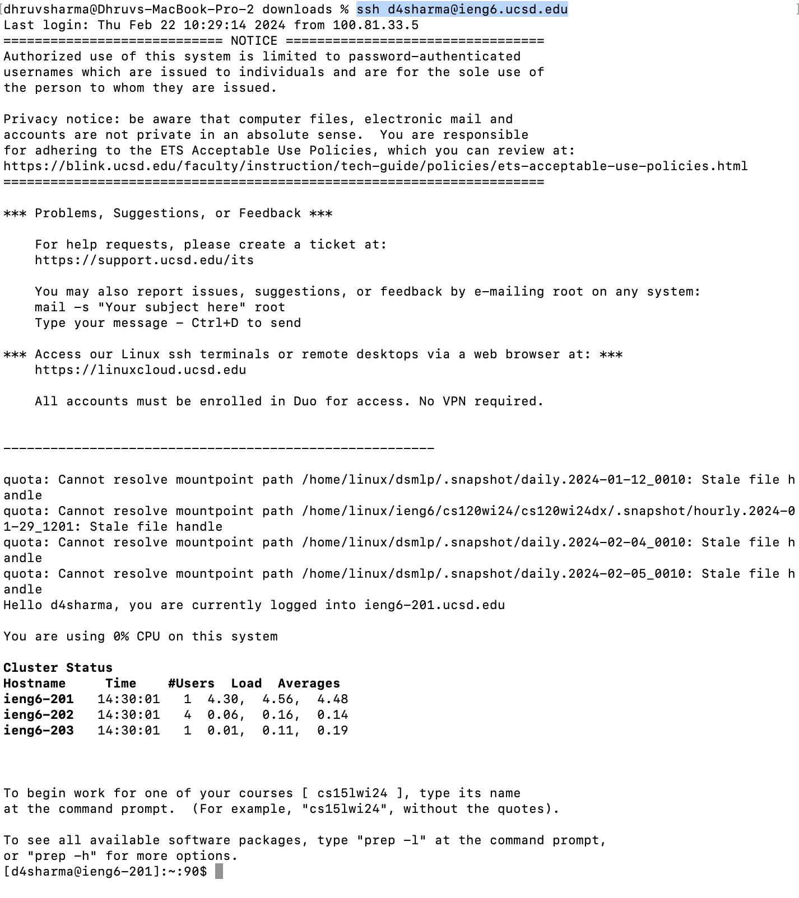
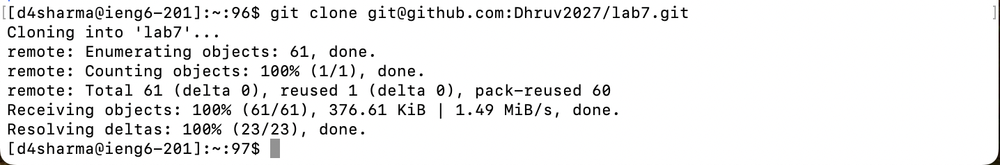
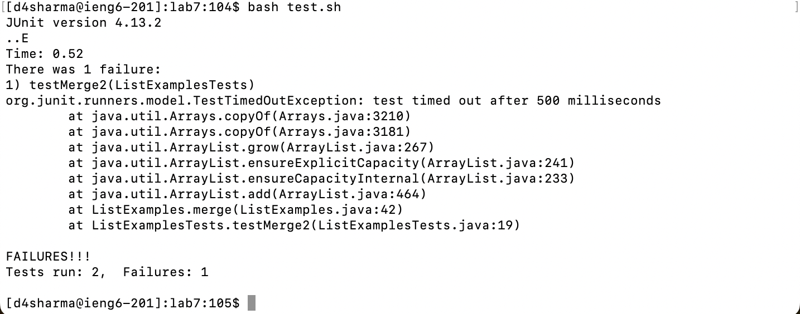
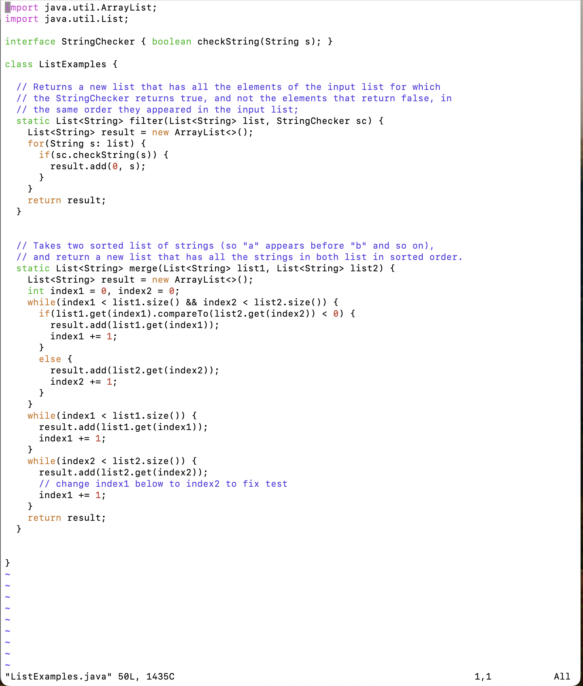
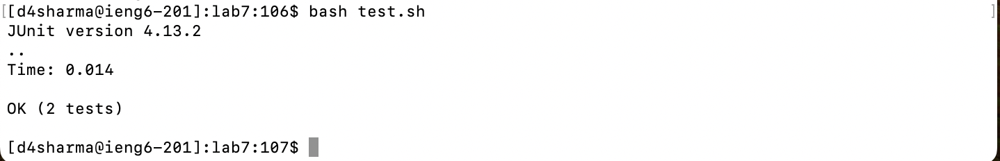
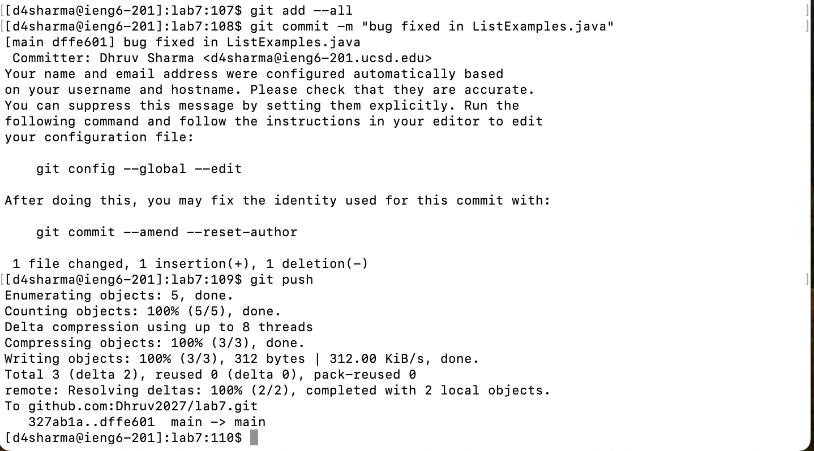

# Lab Report 4

## Replicating steps 4 - 9

### Step 4:
The command I used: `ssh d4sharma@ieng6.ucsd.edu` and then pressing `<enter>`.

Here is the output:

***
### Step 5:
The command I used: `git clone git@github.com:Dhruv2027/lab7.git` and then I pressed `<enter>`.

***
### Step 6:
Next, I changed my working directory to `/home/linux/ieng6/oce/12/d4sharma/lab7` by using the `cd lab7` command and then pressing `<enter>`. This would allow me to work with the files in the directory easily. Then, I entered the command: `bash test.sh` and pressed `<enter>`. The output now:

***
### Step 7:
Command: `vim ListExamples.java` and then `<enter>`. The output now: 

Now, my exact keystrokes are: `43j`, `e`, `x`, `i`, `2`, `<esc>`, `:wq`, `<enter>`.

To show what exactly happened, the command `43j` moved the cursor down 43 lines. The cursor was on the 1st line, so moving down 43 lines got me to line 44, which is the location of the error. Then, I pressed `e`, which brought me to the end of the word, which was `index1` ie: the cursor moved to the "1" of `index1`. Pressing `x`, I removed that character (removed "1"). Next, I pressed `i` to enter "insert mode". After that, I entered "2", so the word was now `index2`. To save my changes, I pressed `<esc>` to exit insert mode and enter normal mode. Then, pressed `:wq` followed by `<enter>` which saved my changes and brought me out of the file.
***

### Step 8:
Checking that the corrected code now works, I entered the command `bash test.sh` and got the following output: 

This shows that my edit worked.

***

### Step 9:
To push the changes, I completed the following steps:
1. I entered the command `git add --all`, which adds and saves any and all changes made to the directory.
2. Enter `git commit -m "fixed ListExamples.java"` and then pressed `<enter>`. This commits the changes to the local git repository with a message (message is in quotes after the `-m`).
3. Enter `git push` and then `<enter>`, which saves and syncs the edits I made with my github account.

