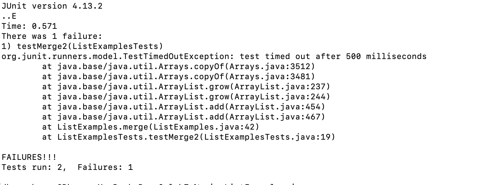
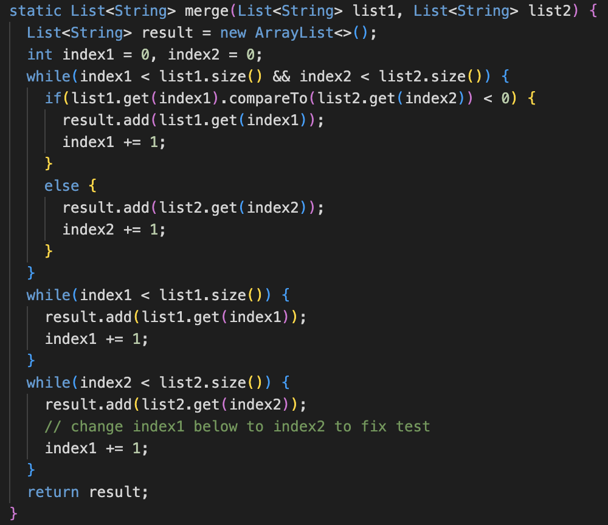
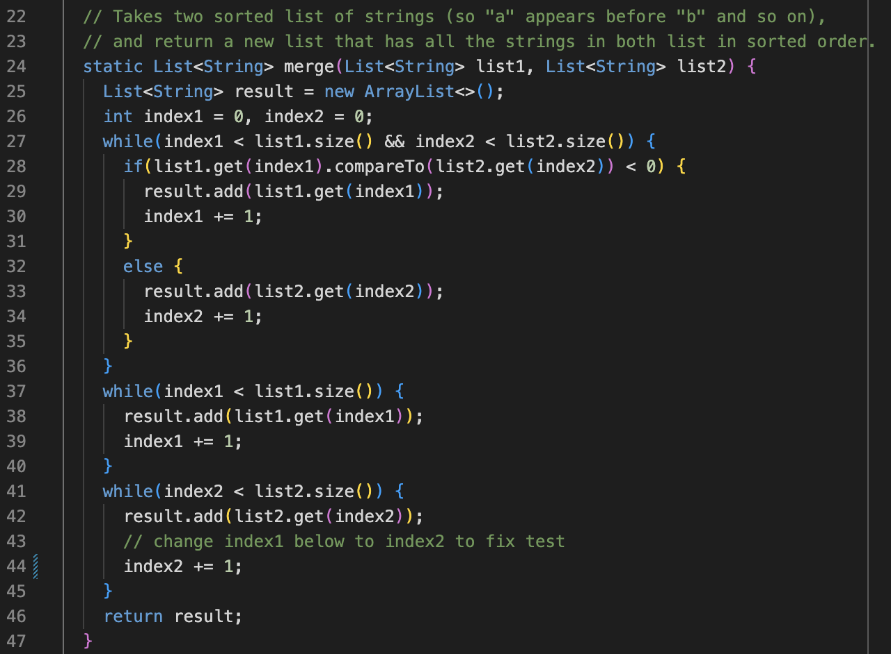
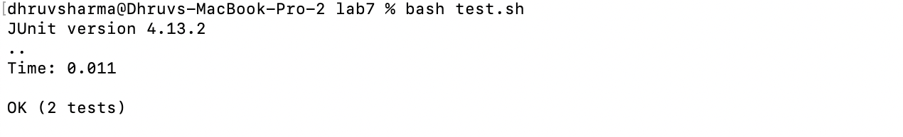

# Week 9 - Putting it all Together

# Part 1 - Debugging Scenario

### Stephen Strange (Student)
Hi, I keep failing my `merge()` method. When I use the `test.sh` file to test my code, it says that my test `"timed out after 500 milliseconds"`. I have attached the screenshot of my JUnit output and the method I am currently using. Thank you for your help.

### TA
Hi Stephen, given your output, I can tell that you are in an infinite loop (because of the timeout), which means one of your `while` loops is not being updated correctly. Trace through your `while` loops again and check if you update everything in that loop to ensure you break out of the loop. 

Hint: in your output message, it says `TestTimedOutException: test timed out after 500 milliseconds at ... at ListExamples.merge(ListExamples.java:42)`. You may want to look somewhere near there.

### Student
OH! I see now, because I was updating `index1` instead of `index2` in the third `while` loop, and was stuck in an infinite loop. I'll just change `index1` to `index2` and that should fix the bug. That makes a lot of sense. 

OH YES! IT PASSED. THANK YOU SO MUCH!

# Part 2 - Reflection
I have learnt a lot throughout the quarter, but specifically in the second half, it was interesting to learn that I can edit files through the command line itself. I always thought that I had to open VSCode to edit my code files. However, now if I want to make a quick edit, I just use vim and make my changes. Secondly, I found using JDB was extremely useful while debugging my PAs in CSE 12. Although it took time, it was easy to understand where exactly my code was going wrong as I could see all the references using the `locals` command. I think that command is one of the most useful commands in all of java. 
