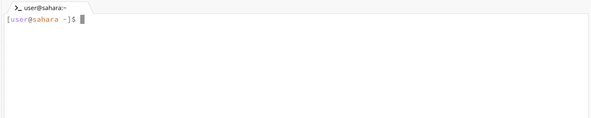

# Lab Report 1
This lab report contains information regarding the 3 basic commands in command line: `cd`, `ls`, and `cat`. I have already cloned the "lecture1" repository in my workspace using the command `git clone https://github.com/ucsd-cse15l-f23/lecture1`.

I will be beginning my report starting from the `/home` directory.

## The `cd` Command
The terminal looks like this right now: 

Now, I will type `cd` in the terminal and get this output:

Reason for this output is that I am in the home directory (folder), ie: the default directory. If I change the working directory (the folder I am in currently) to say, `lecture1` and then enter cd again, I will return to the default `/home` directory.

I can enter the `lecture1` directory (folder) by entering the command `cd lecture1`. Here's the output: 

As we can see, in the terminal `~/lecture1` is written next to `user@sahara`. Thus, it can be seen that the directory has been changed to lecture1. To prove further, I have used the command, `pwd` to print the current (working) directory. 

Now, I will type `cd` in the terminal again and this will change the directory back to the `home` directory. 

Now, we have seen that we can change the directory to a folder, but can we change it to a file? I will type `cd lecture1` in the terminal and then enter `cd Hello.java` to change the directory to Hello.java.

Well, it turns out we cannot change the directory to a file as a directory literally means "folder".

