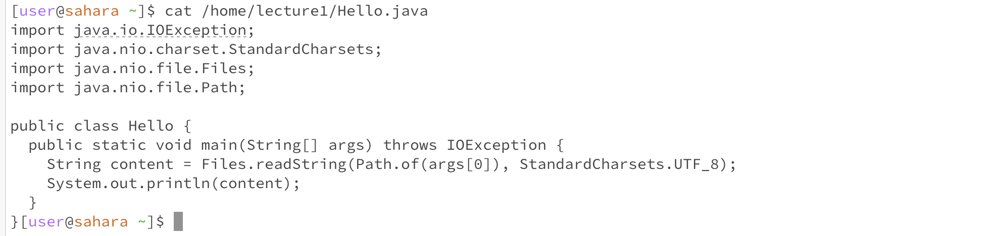
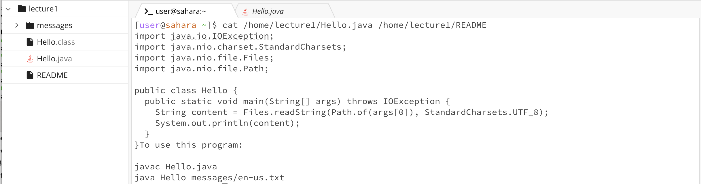
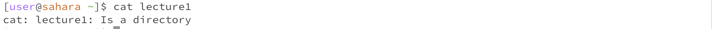
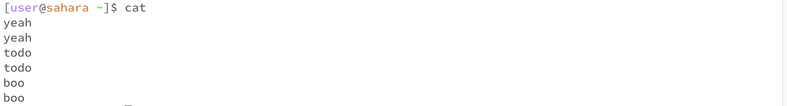

# Lab Report 1
This lab report contains information regarding the 3 basic commands in command line: `cd`, `ls`, and `cat`. I have already cloned the "lecture1" repository in my workspace using the command `git clone https://github.com/ucsd-cse15l-f23/lecture1`.

I will be beginning my report starting from the `/home` directory.

## The `cd` Command
The terminal looks like this right now: 


Now, I will type `cd` in the terminal and get this output:


Reason for this output is that I am in the home directory (folder), ie: the default directory. If I change the working directory (the folder I am in currently) to say, `lecture1` and then enter cd again, I will return to the default `/home` directory.

I can enter the `lecture1` directory (folder) by entering the command `cd lecture1`. Here's the output: 


As we can see, in the terminal `~/lecture1` is written next to `user@sahara`. Thus, it can be seen that the directory has been changed to lecture1. To prove further, I have used the command, `pwd` to print the current (working) directory. 


Now, I will type `cd` in the terminal again and this will change the directory back to the `home` directory. 


Now, we have seen that we can change the directory to a folder, but can we change it to a file? I will type `cd lecture1` in the terminal and then enter `cd Hello.java` to change the directory to Hello.java.


Well, it turns out we cannot change the directory to a file as a directory literally means "folder".

***

## The `ls` Command

To give a general overview, the `ls` command gives a list of the files or folders stored in the **working directory**. So, if I type `ls` when I am in the `home` directory, I will get: 


The output makes sense, as we can see that there is only one "thing" in the `home` directory and that is "lecture1" folder. Now, if I change the directory to lecture1 and type `ls`, we will see each folder and file saved inside the directory.


As we can see, each file or folder in lecture1 has been printed in the command line. Now, you may be thinking that do we need to always change directory and then type `ls`. Luckily, we don't need to do that. Just typing `ls` and following that with the folder whose contents we want to see will achieve the same purpose. Here is an example: 


See! I am seeing the same output as before, but with just a single command. 

Now, can we use the `ls` command on a file? Let's see. First, I will change the directory to `lecture1` (there is no file in the `home` directory). Then, I will use the `ls` command on `Hello.java` file. 


So, the `ls` command just repeats the file name when a file is entered, so it is not particularly useful to view the contents of a file. For this purpose, the `cat` command is more useful. 

***

The `cat` command stands for "concatenate", which essentially means that it will print out the contents of any number of files one after another. To make this printing happen, I need to enter the file paths right after typing `cat`. So, if I type in `cat` with the path for "Hello.java", here is what I get: 



As you can see, the contents of the file "Hello.java" have been printed. To verify, here are the actual contents of the "Hello.java" file: 

```java
import java.io.IOException;
import java.nio.charset.StandardCharsets;
import java.nio.file.Files;
import java.nio.file.Path;

public class Hello {
  public static void main(String[] args) throws IOException {
    String content = Files.readString(Path.of(args[0]), StandardCharsets.UTF_8);    
    System.out.println(content);
  }
}
```

Now, if I want to see the contents of 2 files, I just write the paths of both the files after the `cat` command. Here is an example: `cat <path1> <path2>`. Using the "Hello.java" and "README" files, I'll show an example of concatenating 2 files.



Now, what if I type `cat` and write a folder name after it? Will it concatenate every single file in the folder? Let's see: 



Oh no! An error message is printed claiming that "cat: lecture1: Is a directory". This is output as the `cat` command is designed to output the contents of files, not concatenate an entire directory. Now, what if we pass no arguements after `cat`?



Well, since no arguement is passed, whatever you input will be output back to you. As can be seen in the output above, I wrote "yeah", "todo", and "boo", each of which were repeated. This process will be terminated when "control + D" is pressed. This happens because the command is meant to work with an arguement, so without an arguement, it just repeats whatever the user inputs.
