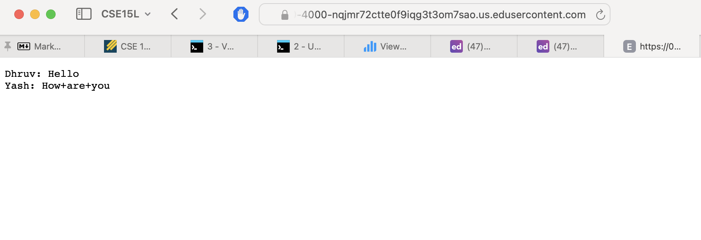
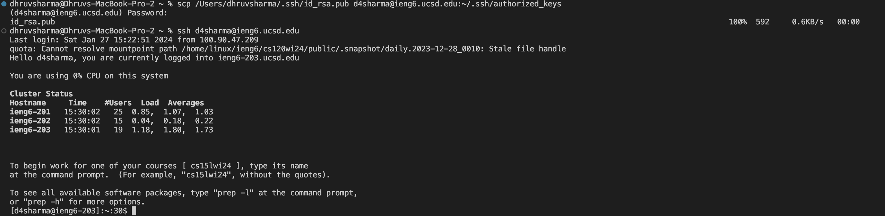

# Lab Report 2
***
In the code below, I am storing the string after `s=` and `user=` in the variable `script`. Each time `add-message` is written, the script variable is updated with the new values and is output. 
## Part 1
```java
import java.io.IOException;
import java.net.URI;
import java.util.*;

class Handler implements URLHandler {
    // The one bit of state on the server: a number that will be manipulated by
    // various requests.
    // int num = 0;
    String script = "";

    public String handleRequest(URI url) {
        if (url.getPath().contains("/add-mesage")) {
            String[] parameters = url.getQuery().split("&");
            script += parameters[1].split("=")[1] + ": "+ parameters[0].split("=")[1] + '\n';
            return script;
        }
    
        return "404 Not Found!";
    }
}

class ChatServer {
    public static void main(String[] args) throws IOException {
        if(args.length == 0){
            System.out.println("Missing port number! Try any number between 1024 to 49151");
            return;
        }

        int port = Integer.parseInt(args[0]);

        Server.start(port, new Handler());
    }
}
```

Here are two examples of me using the code to add messages on the website:


In the above screenshot, at the end of the URL, I typed `/add-message?s=Hello&user=Dhruv`. When I press enter, the page is reloaded and the java code runs in the background. The java code contains some methods, whose functionality I will explain below: 

* **Methods called**: First, the main method in ChatServer runs, taking an integer input as the port. Next, the above code uses another java file named Server.java with which a new server is created, taking the port and an object of type `Handler`. As `Handler` is called, the method 'handleRequest` is called to split the query into the parts we need, ie: the user's name and their message. Other helper methods like `getPath()`,`getQuery()`, `contains()`, `split()`, and `Integer.parseInt()` are used to help retrieve the relevant parts of the URL.
* **Relevant Arguements**: The `handleRequest()` method uses the URL as the parameter. The URL is then checked if it contains the `add-message` string using the `contains()`
 method. Then, using the `split()` method, query is split at the `&` character. The results of the split are stored in the parameters array. This elements of this array are then split again at the `=` character so that the user and their message can be output. This result is stored in the variable `script`.
* **Value Changes**: When the `/add-message?s=Hello&user=Dhruv` request is made, the script variable is updated from `script = ""` to `script = Dhruv: Hello` using the methods above. Furthermore, the parameters array is updated each time `handleRequest()` is called, so the value of `script` is updated to show the new output.



In the above screenshot, at the end of the URL, I typed  `/add-message?s=How are you&user=Yash`. When I press enter, the page is reloaded and the java code runs in the background. 

* **Methods called**: This time, the `handleRequest()` method is called as the request has been updated. Again, the query is split along the `&` character and stored in the parameters array. The resultant parameters are again split along `=` using the aforementioned helper methods. None of the other methods are required as the website is already up and running.
* **Relevant Arguements**: As before, the only relevant arguements to this method is the URL, so that the query can be split and the user along with their message, can be retrieved.
* **Value Changes**: As a result of the update, the `script` variable is also updated to `Dhruv: Hello \n Yash: How+are+you`. The parameters array is updated to contain "Yash" and "How+are+you". There are pluses in between the spaces here as the URL cannot have empty spaces between characters, so it fills them with special characters, resulting in the "+" signs. 

***
## Part 2
In the screenshot below, I have used the command `ssh-keygen` to create a public/private key pair. 


As can be seen in the screenshot, my private key has been saved in the path `/Users/dhruvsharma/.ssh/id_rsa` and my public key has been saved in the path `/Users/dhruvsharma/.ssh/id_rsa.pub`. This means that the keys are stored in a folder named `.ssh` with the path `/Users/dhruvsharma/.ssh`.



While on my local terminal, I, using the `scp` command, I securely copied my `id_rsa.pub` key into the `~/.ssh/authorized_keys` folder in `ieng6`. Next, I just entered the regular command to ssh into the `ieng6` account, `ssh d4sharma@ieng6.ucsd.edu`. As can be seen, I did not need to enter the password in this interaction. 
***
## Part 3
Over the past few weeks, I learnt how to connect to a server using `ssh`. I had heard of the term `ssh` but had no idea what it did. After coming into the class I realised exactly what each of the commands do and how the terminal works (atleast on a surface level). Over the last couple of weeks I also learnt aboout how websites can be created and watch its contents change using java by writing commands in the URL. These concepts are very new to me, so was a good learning opportunity. Furthermore, I learnt about URL and its specific parts. The only part I knew prior to the course was the domain, but now I can see that there are many parts to the URL like the query, anchor, etc. I also did not realise that the URL itself was a kind of path to the content we want to view.
