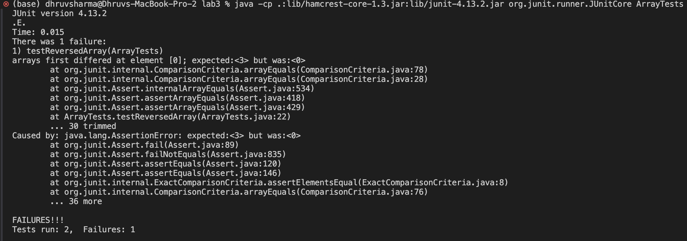

# Lab Report - 3

## Part 1 - Bugs
In this section, I will be exploring bugs in the ArrayExamples.java file from week 4's lab session. First, I forked the `https://github.com/ucsd-cse15l-f23/lab3` repository and then used the following commands in the terminal to run and test the code.
```
local $ javac -cp .:lib/hamcrest-core-1.3.jar:lib/junit-4.13.2.jar *.java
local $ java -cp .:lib/hamcrest-core-1.3.jar:lib/junit-4.13.2.jar org.junit.runner.JUnitCore ArrayTests
```
As of now, there are only 2 tests, which ran perfectly. However, when I added more tests they failed. One of the failed tests: 
Code: 
```java
static int[] reversed(int[] arr) {
  int[] newArray = new int[arr.length];
  for(int i = 0; i < arr.length; i += 1) {
    arr[i] = newArray[arr.length - i - 1];
  }
  return arr;
}
```

```java
@Test
public void testReversedArray(){
  int[] input1 = { 1, 2, 3 };
  assertArrayEquals(new int[]{ 3, 2, 1 }, ArrayExamples.reversed(input1));
}
```

In this case, the error was that the test expected <3>, but was actually <0>. 

In another case, in the test:
```java
@Test
public void testReversed() {
  int[] input1 = { };
  assertArrayEquals(new int[]{ }, ArrayExamples.reversed(input1));
}
```
The test works perfectly. When there is no input, the program correctly returns no array, thus passing the test.



As can be seen in the above screenshot, 2 tests are run with one passing and one failing. The symptom here is that something that was expected is not mirrored in what was actually produced. The test expected the value of 3, but got a value of 0. The bug here is that the new array which is to be returned is not getting reversed. Instead, each value in the original array is being replaced with 0. To fix the error, I updated the old code to remove the bug.

```java
//old, buggy code
static int[] reversed(int[] arr) {
  int[] newArray = new int[arr.length];
  for(int i = 0; i < arr.length; i += 1) {
    arr[i] = newArray[arr.length - i - 1];
  }
  return arr;
}

//new, bug-less code
static int[] reversed(int[] arr) {
  int[] newArray = new int[arr.length];
  for(int i = 0; i < arr.length; i += 1) {
    newArray[i] = arr[arr.length - i - 1];
  }
  return newArray;
}
```

All I changed here was replacing the `arr` on the left hand side with `newArray` and `newArray` on the right with `arr`. This fixes the code as when I run the java test again, I get the following output: 

```
(base) dhruvsharma@Dhruvs-MacBook-Pro-2 lab3 % javac -cp .:lib/hamcrest-core-1.3.jar:lib/junit-4.13.2.jar *.java                              
(base) dhruvsharma@Dhruvs-MacBook-Pro-2 lab3 % java -cp .:lib/hamcrest-core-1.3.jar:lib/junit-4.13.2.jar org.junit.runner.JUnitCore ArrayTests
JUnit version 4.13.2
..
Time: 0.014

OK (2 tests)
```

***
## Part 2 - Researching Commands
I will be talking about the `grep` command. I will explore how the `-i`, `-r`, `-n`, and `"[A-Z]"` commands in `grep` work. I am starting from the `/docsearch/` directory and will change the directory to `/docsearch/technical/` and search for the files in the `plos` folder.

### `grep -i "<argument>" file.txt` function

I entered the command `grep -i "plos" plos/pmed.0020203.txt` while in the `docsearch/technical/` directory to search for each occurrence of the `plos` keyword in the file `pmed.0020203.txt`. The output I received is shown below: 

```
dhruvsharma@Dhruvs-MacBook-Pro-2 technical % grep -i "plos" plos/pmed.0020203.txt 
      PLoS Medicine is a sufficiently new journal that we are often doing
      PLoS Medicine ? Although our journal's focus is on human studies, we have
      PLoS Medicine . These include studies that explore off-label uses of
      PLoS Medicine . Instead, we encourage submission of important advances
      PLoS Biology , our flagship open-access biology journal
      (www.plosbiology.org).
      PLoS Medicine has published a number of Perspectives on research articles
      PLoS Biology , and 
      PLoS Biology regularly highlights papers from 
      PLoS Medicine on its home page. In this way, because all our journals are
      PLoS Medicine and any other PLoS journal, is just a rodent click.
```

Here, each line of the output shows the line where the keyword "plos" is used. This function is particularly useful as the developer may never know when the keyword has been capitalized or has a mix of capital letters and non capital letters. The `-i` function removes this uncertainty as it gives an output regardless of capitalisation. 

In the next scenario, it may be beneficial to find out which part of the document in `government/About_LSC/ODonnell_et_al_v_LSCdecision.txt` contains the word "legal" as part of the arguement or if it is part of a legal services company. It makes searching for the context of the word "legal" a lot easier. The output: 

```
dhruvsharma@Dhruvs-MacBook-Pro-2 technical % grep -i "legal" government/About_LSC/ODonnell_et_al_v_LSCdecision.txt 
HUGH F. O'DONNELL, Executive � Director of Client Centered Legal
Services of Southwest Virginia, Incorporated; CLIENT CENTERED LEGAL
JOHN EIDLEMAN, Program Specialist for the Legal Services
Corporation; LEGAL SERVICES CORPORATION; JOHN MCKAY, President of
the Legal Services Corporation,
Client Centered Legal Services of Southwest Virginia,
granting judgment in favor of the Legal Services Corporation and
In 1974, Congress enacted the Legal Service Corporation Act
("LSCA"), which created the LSC for the purpose of providing legal
2996 (West 1994). The LSC does not itself provide legal services,
but rather grants federal funds to legal services programs across
the country. CCLS, which provides legal services to indigent people
In our recent decision in Regional Management Corp. v. Legal
specifically intended the LSCA to benefit "indigents who have legal
grievances but who are unable to afford the legal means necessary
the "especial benefit" of indigent persons in need of legal
services. Although legal services programs such as CCLS are an
affect grantees. See Tex. Rural Legal Aid, Inc. v. Legal Servs.
(D.C. Cir. 1991); San Juan Legal Servs., Inc. v. Legal Servs.
Corp., 655 F.2d 434, 438-39 (1st Cir. 1981); Spokane County Legal
Servs., Inc. v. Legal Servs. Corp., 614 F.2d 662, 668-69 (9th Cir.
```

### `grep -n <arguement> file.txt` function
In this part, I will focus on how the `grep -n` function works. To give an overview, the function outputs the line numbers of where the `<arguement>` occurs. I will use the same files as above, but with the new function. 

The output using `grep -n "plos" plos/pmed.0020203.txt`:
```
dhruvsharma@Dhruvs-MacBook-Pro-2 technical % grep -n "plos" plos/pmed.0020203.txt                               
57:        (www.plosbiology.org).
```
This output may be a little surprising (atleast, I was) given that previously we got a lot bigger output than just one line. To get the previous output with the line numbers, we can just edit the command by adding `-n`: 
```
dhruvsharma@Dhruvs-MacBook-Pro-2 technical % grep -i -n "plos" plos/pmed.0020203.txt
7:        PLoS Medicine is a sufficiently new journal that we are often doing
13:        PLoS Medicine ? Although our journal's focus is on human studies, we have
35:        PLoS Medicine . These include studies that explore off-label uses of
54:        PLoS Medicine . Instead, we encourage submission of important advances
56:        PLoS Biology , our flagship open-access biology journal
57:        (www.plosbiology.org).
64:        PLoS Medicine has published a number of Perspectives on research articles
66:        PLoS Biology , and 
67:        PLoS Biology regularly highlights papers from 
68:        PLoS Medicine on its home page. In this way, because all our journals are
70:        PLoS Medicine and any other PLoS journal, is just a rodent click.
(base) dhruvsharma@Dhruvs-MacBook-Pro-2 technical % grep -n "plos" plos/pmed.0020203.txt   
```
The reason why I got the previous output was that only line 57 had "plos" in lower case. This is just a reminder that we need to be careful that the command line is case-sensitive. Combining `-i -n` gives the line numbers of each instance of "plos", which is particularly helpful if we wish to search for some keyword with greater accuracy than just `-i`.

Next, it may be helpful to draw connections about where "Legal" is used in the document `government/About_LSC/ODonnell_et_al_v_LSCdecision.txt`. This will be helpful to draw connections between the arguements used by "Legal Services" and the larger case at hand.

```
dhruvsharma@Dhruvs-MacBook-Pro-2 technical % grep -n "Legal" government/About_LSC/ODonnell_et_al_v_LSCdecision.txt
8:HUGH F. O'DONNELL, Executive � Director of Client Centered Legal
14:JOHN EIDLEMAN, Program Specialist for the Legal Services
16:the Legal Services Corporation,
42:Client Centered Legal Services of Southwest Virginia,
45:granting judgment in favor of the Legal Services Corporation and
52:In 1974, Congress enacted the Legal Service Corporation Act
68:In our recent decision in Regional Management Corp. v. Legal
119:affect grantees. See Tex. Rural Legal Aid, Inc. v. Legal Servs.
121:(D.C. Cir. 1991); San Juan Legal Servs., Inc. v. Legal Servs.
122:Corp., 655 F.2d 434, 438-39 (1st Cir. 1981); Spokane County Legal
123:Servs., Inc. v. Legal Servs. Corp., 614 F.2d 662, 668-69 (9th Cir.
```

### `grep -r "<argument>" path/to/directory` function
This function searches all the files in the current directory and sub-directories (if any) for the argument listed. For example, if I want to search for the word "chapter" in the `911report` directory, this is my output:
```
dhruvsharma@Dhruvs-MacBook-Pro-2 technical % grep -r "chapter" 911report
911report/chapter-13.4.txt:                in chapter 2, we do not agree with this assessment. On Bin Ladin's reactions to
911report/chapter-13.4.txt:                for the record, July 13, 2004. As discussed in chapter 7, we have examined three
911report/chapter-13.4.txt:                chapter 8. That was not known at the time. Mihdhar was met at the Kuala Lumpur
911report/chapter-13.4.txt:            234. In chapter 3, we discuss how this problem arose. By 2001, it had become worse.
911report/chapter-13.4.txt:            5. Notably, as discussed in chapter 5, precisely such arrangements-in the form of
911report/chapter-13.4.txt:                chapter
911report/chapter-13.4.txt:                is referred to as the "Phoenix memo," discussed in chapter 8.) For Hanjour obtaining
911report/chapter-13.4.txt:                later in this chapter, may have had a role in recruiting one or more of the muscle
911report/chapter-13.5.txt:                the number of hijackers. As discussed later in this chapter, he was refused entry.
911report/chapter-13.5.txt:                operation. See chapter 5.2. He has also stated that Atta included a nuclear plant in
911report/chapter-13.5.txt:                1998, hijacking article (in chapter 4) and the August 6, 2001, article discussing
911report/chapter-13.5.txt:                Bin Ladin's plans to attack in the United States (in this chapter)-were eventually
911report/chapter-13.5.txt:                CIA cable, follow-up source on KSM, July 11, 2001. As noted in chapter 7, KSM has
911report/chapter-13.5.txt:                discussed in chapter 3, and specifically from a March 1995 memorandum of then Deputy
911report/chapter-13.5.txt:                through the OIPR screen. What had happened, as we discussed in chapter 3, was a
911report/chapter-13.5.txt:                regulations, "Regulations" chapter of "Operational Procedures and Policies," July
911report/chapter-13.5.txt:                Company Operations" chapters of "Operational Procedures and Policies," July 1999.
911report/chapter-13.5.txt:            23. FDNY regulations, "Communications" chapter of "Operational Procedures and
911report/chapter-13.5.txt:                review contacts between Iraq and al Qaeda in chapter 2. We have found no credible
911report/chapter-13.5.txt:            15. For Murad's idea, see chapter 5, note 33.
911report/chapter-13.5.txt:                National Intelligence Director we recommend later in this chapter.
911report/chapter-13.1.txt:                opportunities,"some of which we reviewed in chapter 11. These are often
911report/chapter-13.1.txt:                "connecting the dots." In chapter 11 we explained that these labels are too narrow.
911report/chapter-13.1.txt:                    described in chapter 12.
911report/chapter-13.1.txt:                still not sized or funded to be an executive agency. In chapter 3 we described some
911report/chapter-13.1.txt:                regions, countries, and issues that we discuss in chapter 12. Much of the job of
911report/chapter-13.1.txt:            We summarized the resulting organization of the intelligence community in chapter 3.
911report/chapter-13.1.txt:                    civil-military misunderstandings we described in chapter 4. It is a problem to
911report/chapter-13.1.txt:                describe in chapter 8, the information is distributed, but in a compartmented
911report/chapter-13.1.txt:            In chapter 6, we described the transition of 2000-2001. Beyond the policy issues we
911report/chapter-13.1.txt:                all-out effort to institutionalize change-can do the job. As we mentioned in chapter
911report/chapter-13.3.txt:                summarized in chapter 2.
911report/chapter-3.txt:            In chapter 2, we described the growth of a new kind of terrorism, and a new terrorist
911report/chapter-3.txt:                organized the bombing of two U.S. embassies. In this chapter, we trace the parallel
911report/chapter-3.txt:                institutional beliefs and practices in chapter 8.
911report/chapter-3.txt:                chapter 6, questioning by an especially alert Customs inspector led to the arrest of
911report/chapter-3.txt:            Subsequent chapters will raise the issue of whether, despite tremendous talent,
911report/chapter-3.txt:                (Timothy Mc Veigh in Oklahoma City). As we pointed out in chapter 3, the White House
911report/chapter-2.txt:                airliners over the Pacific. Details on these plots appear in chapter 3.
911report/chapter-2.txt:                in chapter 7, al Qaeda contacts with Iran continued in ensuing years.
911report/chapter-1.txt:    Others in the agency were aware of it, as we explained earlier in this chapter.
911report/chapter-5.txt:                Karachi; Mihdhar traveled from Yemen. As discussed in chapter 6, U.S. intelligence
911report/chapter-5.txt:                plot, even as late as the summer of 2001, as discussed in chapter 7.
911report/chapter-5.txt:            As we explained in chapter 2, Bin Ladin did not fund al Qaeda through a personal
911report/chapter-5.txt:                discussed in more detail in chapter 7.
911report/chapter-6.txt:            In chapters 3 and 4 we described how the U.S. government adjusted its existing
911report/chapter-6.txt:                mind for the millennium period. In chapter 5 we introduced an al Qaeda operative
911report/chapter-6.txt:            In chapter 5, we discussed the dispatch of two operatives to the United States for
911report/chapter-6.txt:                reignited interest in Khallad. We will return to that story in chapter 8.
911report/chapter-6.txt:                government since 1999 and, as we mentioned in chapter 4, the U.S. government as a
911report/chapter-6.txt:            As discussed in chapter 4, plans of this kind were never carried out before 9/11.
911report/chapter-6.txt:            Early in chapter 5 we introduced, along with Khalid Sheikh Mohammed, two other men
911report/chapter-6.txt:                terrorism surged dramatically. In chapter 8, we will explore this reporting and the
911report/chapter-7.txt:            In chapter 5 we described the Southeast Asia travels of Nawaf al Hazmi, Khalid al
911report/chapter-7.txt:                that chapter we also described how Mihdhar was spotted in Kuala Lumpur early in
911report/chapter-7.txt:                asked Khallad (whom we introduced in chapter 5) to maintain email contact with Hazmi
911report/chapter-7.txt:            As we mentioned in chapter 2, while in Sudan, senior managers in al Qaeda maintained
911report/chapter-9.txt:            Like the national defense effort described in chapter 1, the emergency response to
911report/chapter-8.txt:                to locate him. As pointed out in chapter 6, Abu Zubaydah had been a major figure in
911report/chapter-8.txt:                the plot. As seen in chapter 7, al Qaeda's operatives made mistakes. At least two
911report/chapter-8.txt:            In chapter 6 we discussed how intelligence agencies successfully detected some of the
911report/chapter-8.txt:                bombing (we introduced Khallad in chapter 5, and returned to his role in the Cole
911report/chapter-8.txt:                bombing in chapter 6).55 One of the members of the FBI's investigative team in Yemen
911report/chapter-8.txt:                investigation on Zacarias Moussaoui. As mentioned in chapter 7, he had entered the
911report/chapter-8.txt:                chapter 7, Moussaoui had been in contact with and received money from Ramzi
911report/chapter-8.txt:                Surveillance Act to conduct the search (we introduced FISA in chapter 3).
911report/chapter-8.txt:                Moussaoui, as discussed in chapter 7. As in the Moussaoui situation already
911report/chapter-12.txt:            As we mentioned in chapter 2, Usama Bin Ladin and other Islamist terrorist leaders
911report/chapter-12.txt:            Many details in chapters 2, 5, and 7 illustrate the direct and indirect value of the
911report/chapter-12.txt:                dangerous weapons. As we note in chapter 2, al Qaeda has tried to acquire or make
911report/chapter-12.txt:                nuclear weapons for at least ten years. In chapter 4, we mentioned officials
911report/chapter-12.txt:            First, as we will discuss in chapter 13, to open up the sharing of information across
911report/chapter-10.txt:                chapter 3). Ashcroft told us he was determined to take every conceivable action,
911report/chapter-10.txt:                Iraqi intelligence officer (discussed in chapter 7) and a Polish report that
911report/chapter-11.txt:                (reprinted in chapter 4), brought the focus back to more traditional hostage taking;
911report/chapter-11.txt:                the main focus (war in Korea), and as too unrealistic. As we pointed out in chapter
911report/chapter-11.txt:                the embassy bombings of August 1998. We described those decisions in chapter 4. It
911report/chapter-11.txt:            Earlier chapters describe in detail the actions decided on by the Clinton and Bush
911report/chapter-11.txt:                capabilities were in the domestic arena. In chapter 3 we discussed these
911report/chapter-11.txt:                Kuala Lumpur, detailed in chapter 6. In late 1999, the National Security Agency
```
This is useful to find wherever the word "chapter" is used in the entire `911report` directory to pinpoint exactly where the words are used and this can be looked into deeper for any reason. This would be particularly helpful in large programs where there may be errors so developers can easily pinpoint where their code is going wrong.

I can expand this search by moving to the parent directory and entering the same arguement. This is helpful as I can recursively search through the entire directory to search for a particular word and find out exactly where it is used. This will save a considerable amount of time in comparison to manually checking each file and entering `ctrl/cmd + F`.

```
dhruvsharma@Dhruvs-MacBook-Pro-2 technical % grep -r "chapter" .        
./government/Env_Prot_Agen/multi102902.txt:The report is organized into eight chapters and one appendix.
./government/Env_Prot_Agen/multi102902.txt:In this chapter, the resource requirements to retrofit FGD
./government/Env_Prot_Agen/multi102902.txt:equipment resource estimates presented in this chapter are for LSFO
./government/Env_Prot_Agen/multi102902.txt:technologies. This chapter examines the experience and issues for
./government/Env_Prot_Agen/multi102902.txt:The chapter focuses on the resources needed for typical or
./government/Env_Prot_Agen/multi102902.txt:In this chapter, retrofit of SCR will be assessed for coal-fired
./government/Env_Prot_Agen/multi102902.txt:This chapter will explore the combination of these technologies
./government/Env_Prot_Agen/multi102902.txt:multiple retrofits of control technologies, this chapter will
./government/Env_Prot_Agen/multi102902.txt:further discussed under the labor section (6.2) of this chapter.
./government/Env_Prot_Agen/bill.txt:this subchapter.
./government/Env_Prot_Agen/tech_adden.txt:chapter for a discussion of this model.
./government/Alcohol_Problems/Session3-PDF.txt:chapter in a book about interventions with adolescents that
./government/Gen_Account_Office/GovernmentAuditingStandards_yb2002ed.txt:organized by separate chapters for financial audits, attestation
./government/Gen_Account_Office/GovernmentAuditingStandards_yb2002ed.txt:chapters are directed at auditors with a financial audit background
./government/Gen_Account_Office/GovernmentAuditingStandards_yb2002ed.txt:(GAAS) and Attestation Standards. The performance audit chapters
./government/Gen_Account_Office/GovernmentAuditingStandards_yb2002ed.txt:format of separate chapters for field and reporting standards. The
./government/Gen_Account_Office/GovernmentAuditingStandards_yb2002ed.txt:presented in a single chapter.
./government/Gen_Account_Office/GovernmentAuditingStandards_yb2002ed.txt:The presentation of the financial audit chapters proposes
./government/Gen_Account_Office/GovernmentAuditingStandards_yb2002ed.txt:chapters 4 and 5 or by the Statement on Standards for Attestation
./government/Gen_Account_Office/GovernmentAuditingStandards_yb2002ed.txt:Engagements in chapter 6. The term "financial related audits" was
./government/Gen_Account_Office/GovernmentAuditingStandards_yb2002ed.txt:current presentation of separate chapters for field and reporting
./government/Gen_Account_Office/GovernmentAuditingStandards_yb2002ed.txt:chapter 2, and in the presentation of field work and reporting
./government/Gen_Account_Office/GovernmentAuditingStandards_yb2002ed.txt:standards, in chapters 7 and 8, applicable to the various
./government/Gen_Account_Office/GovernmentAuditingStandards_yb2002ed.txt:and user friendly presentation than having a separate chapter
./government/Gen_Account_Office/GovernmentAuditingStandards_yb2002ed.txt:more significant proposed changes made to the chapters for
./government/Gen_Account_Office/GovernmentAuditingStandards_yb2002ed.txt:made to the presentation of the performance audit chapters.
./government/Gen_Account_Office/GovernmentAuditingStandards_yb2002ed.txt:engagements. This work, which is described in this chapter and more
./government/Gen_Account_Office/GovernmentAuditingStandards_yb2002ed.txt:fully in chapter 2, includes financial audits, attestation
./government/Gen_Account_Office/GovernmentAuditingStandards_yb2002ed.txt:described more fully in chapter 2. Accordingly, the focus of this
./government/Gen_Account_Office/GovernmentAuditingStandards_yb2002ed.txt:1.3 This chapter describes the applications of GAGAS by auditors
./government/Gen_Account_Office/GovernmentAuditingStandards_yb2002ed.txt:and audit organizations. This chapter also describes the concept of
./government/Gen_Account_Office/GovernmentAuditingStandards_yb2002ed.txt:services, which are described more fully in chapter 2. However,
./government/Gen_Account_Office/GovernmentAuditingStandards_yb2002ed.txt:which is discussed in chapter 3.
./government/Gen_Account_Office/GovernmentAuditingStandards_yb2002ed.txt:chapters 4 and 5. GAGAS incorporates the AICPA's general standard
./government/Gen_Account_Office/GovernmentAuditingStandards_yb2002ed.txt:unless specifically excluded, as discussed in chapter 6. To meet
./government/Gen_Account_Office/GovernmentAuditingStandards_yb2002ed.txt:This chapter describes the types of audits and
./government/Gen_Account_Office/GovernmentAuditingStandards_yb2002ed.txt:chapters 3 through 8. This chapter also describes other
./government/Gen_Account_Office/GovernmentAuditingStandards_yb2002ed.txt:include more than one type of work described in this chapter or may
./government/Gen_Account_Office/GovernmentAuditingStandards_yb2002ed.txt:chapters 3, 4, and 5 for standards and guidance for auditors
./government/Gen_Account_Office/GovernmentAuditingStandards_yb2002ed.txt:AICPA for attestation engagements. (See chapters 3 and 6 for
./government/Gen_Account_Office/GovernmentAuditingStandards_yb2002ed.txt:performance audit standards in chapters 7 and 8 to the objectives
./government/Gen_Account_Office/GovernmentAuditingStandards_yb2002ed.txt:chapter 6.
./government/Gen_Account_Office/GovernmentAuditingStandards_yb2002ed.txt:chapters 3, 7, and 8 for standards and guidance for auditors
./government/Gen_Account_Office/GovernmentAuditingStandards_yb2002ed.txt:chapter as such services are not audits or attestation engagements.
./government/Gen_Account_Office/GovernmentAuditingStandards_yb2002ed.txt:This chapter prescribes general standards and provides
./government/Gen_Account_Office/GovernmentAuditingStandards_yb2002ed.txt:reporting standards described in the following chapters, in
./government/Gen_Account_Office/GovernmentAuditingStandards_yb2002ed.txt:1See chapter 6 for an additional general standard auditors
./government/Gen_Account_Office/GovernmentAuditingStandards_yb2002ed.txt:announcement.1 This chapter identifies the AICPA field work
./government/Gen_Account_Office/GovernmentAuditingStandards_yb2002ed.txt:accordance with GAGAS. This chapter concludes with guidance that
./government/Gen_Account_Office/GovernmentAuditingStandards_yb2002ed.txt:4.5 This chapter concludes with guidance auditors should give
./government/Gen_Account_Office/GovernmentAuditingStandards_yb2002ed.txt:exceed the minimum audit requirements in the standards in chapters
./government/Gen_Account_Office/GovernmentAuditingStandards_yb2002ed.txt:on Standards for Attestation Engagements. See chapter 6 for a
./government/Gen_Account_Office/GovernmentAuditingStandards_yb2002ed.txt:4.25 As discussed in chapter 1, financial audits contribute to
./government/Gen_Account_Office/GovernmentAuditingStandards_yb2002ed.txt:5.1 This chapter presents reporting standards for financial
./government/Gen_Account_Office/GovernmentAuditingStandards_yb2002ed.txt:announcement.1 This chapter identifies the AICPA generally accepted
./government/Gen_Account_Office/GovernmentAuditingStandards_yb2002ed.txt:over financial reporting. See chapter 6 for a discussion of the
./government/Gen_Account_Office/GovernmentAuditingStandards_yb2002ed.txt:States excludes them by formal announcement.2 This chapter
./government/Gen_Account_Office/GovernmentAuditingStandards_yb2002ed.txt:1 See chapter 2 for examples of objectives for attestation
./government/Gen_Account_Office/GovernmentAuditingStandards_yb2002ed.txt:under GAGAS, as discussed in chapter 3.
./government/Gen_Account_Office/GovernmentAuditingStandards_yb2002ed.txt:7.1 This chapter prescribes field work standards and provides
./government/Gen_Account_Office/GovernmentAuditingStandards_yb2002ed.txt:answer. (See chapter 2.)
./government/Gen_Account_Office/GovernmentAuditingStandards_yb2002ed.txt:2This chapter uses only the term program; however, the concepts
./government/Gen_Account_Office/GovernmentAuditingStandards_yb2002ed.txt:standards in this chapter as appropriate. Even if auditors do not
./government/Gen_Account_Office/GovernmentAuditingStandards_yb2002ed.txt:attestation engagements contained in chapter 6.
./government/Gen_Account_Office/GovernmentAuditingStandards_yb2002ed.txt:8.1 This chapter prescribes reporting standards and provides
./government/Gen_Account_Office/GovernmentAuditingStandards_yb2002ed.txt:chapter report or a letter report, briefing slides may be
./government/Gen_Account_Office/GovernmentAuditingStandards_yb2002ed.txt:As discussed in chapter 7, findings often have been
./government/Gen_Account_Office/Sept27-2002_d02966.txt:Treasury Employees Union chapters in his area.
./government/Gen_Account_Office/Sept27-2002_d02966.txt:chapters and employee organizations; as well as questions on issues
./government/Gen_Account_Office/d01376g.txt:35 by enacting a new subchapter on "Information Security." The
./government/Gen_Account_Office/Statements_Feb28-1997_volume.txt:described above. Each statement is presented as a separate chapter.
./government/Gen_Account_Office/Statements_Feb28-1997_volume.txt:discussed in detail in their respective chapters of this
./government/Gen_Account_Office/Statements_Feb28-1997_volume.txt:chapter of this Statement, it believes that these stewardship items
./government/Gen_Account_Office/Statements_Feb28-1997_volume.txt:Government; this same effective date applies to chapter 8 as it
./government/Gen_Account_Office/Statements_Feb28-1997_volume.txt:the consolidated financial statements, except for chapter 8, is
./government/Gen_Account_Office/pe1019.txt:In brief, the six types of case study, which we examine in chapter
./government/Gen_Account_Office/pe1019.txt:chapter, we turn to two basic questions: What do we need to take
./government/Gen_Account_Office/pe1019.txt:discussed in the General Policy Manual, chapter 8.0. The
./government/Gen_Account_Office/pe1019.txt:discussed in General Policy Manual, chapter 8.0.
./government/Gen_Account_Office/pe1019.txt:results in his final chapter.
./government/Gen_Account_Office/pe1019.txt:collected, and how they are analyzed. In the last chapter, we
./government/Gen_Account_Office/pe1019.txt:Manual, chapter 8.0. Of these ways, the approaches that most
./government/Gen_Account_Office/Oct15-2001_d0224.txt:development of local chapters associated with each of the FBI's 56
./government/Gen_Account_Office/Oct15-2001_d0224.txt:and 65 chapters.
./government/Gen_Account_Office/Oct15-2001_d0224.txt:InfraGard chapters establish direct contact between law
./government/Gen_Account_Office/d01186g.txt:U.S.C. chapters 55 and 61 and 29 U.S.C. 201 et seq., the records
./government/Gen_Account_Office/d01186g.txt:chapters 55 and 61 and 29 U.S.C. 201 et seq.
./government/Gen_Account_Office/im814.txt:The audit guide consists of 10 chapters, with appendixes.
./government/Gen_Account_Office/im814.txt:The nine chapters present audit guidance on:
./government/Gen_Account_Office/im814.txt:Each chapter lists audit objectives, commonly expected
./government/Gen_Account_Office/im814.txt:regulations and guidance. The chapters are intended to assist in
./government/Gen_Account_Office/im814.txt:The chapters of this audit guide focus on logically distinct
./government/Gen_Account_Office/im814.txt:chapters for reviewing the various steps of an acquisition. In
./government/Gen_Account_Office/im814.txt:Each of the following chapters provides references to
./government/Gen_Account_Office/im814.txt:regulations and other guidance relevant to material in the chapter.
./government/Gen_Account_Office/im814.txt:In addition, each chapter identifies specific audit objectives and
./government/Gen_Account_Office/im814.txt:chapter sets out audit steps to help plan and conduct the
./government/Gen_Account_Office/im814.txt:This chapter focuses on levels of commitment and support for a
./government/Gen_Account_Office/im814.txt:The purpose of this chapter is to guide the auditor in
./government/Gen_Account_Office/im814.txt:• GSA, Overview Guide, chapter 9: Installation and
./government/Gen_Account_Office/im814.txt:Each chapter of this guide lists applicable reference materials
./government/Gen_Account_Office/d02701.txt:program examples in chapter 3, managers decided to move forward in
./government/Post_Rate_Comm/ReportToCongress2002WEB.txt:. . in accordance with the provisions of this chapter." Section
./government/Media/Legal_system_fails_poor.txt:The Somerset County chapter of the American Civil Liberties
./government/Media/Legal_system_fails_poor.txt:chapter.
./government/Media/Pro_Bono_Services.txt:The Chicago chapter of the Legal Marketing Association will
./government/Media/FortWorthStarTelegram.txt:Fort Worth chapter of the NAACP more than $1 million to help
./government/Media/Disaster_center.txt:Aid also is available from the local chapter of the Red Cross,
./government/Media/Disaster_center.txt:Daletta Andreas, Hill Country chapter executive director, said
./government/Media/Disaster_center.txt:the chapter has received calls from people who thought registering
./government/Media/Assuring_Underprivileged.txt:student-run chapter of the American Civil Liberties Union in New
./plos/journal.pbio.0020419.txt:        Francis is captured in the final chapter of Marr's now classic book “Vision” (Marr 1982).
./plos/journal.pbio.0020187.txt:        consumption in pensions and health care; most chapters focus on the United States, but the
./plos/journal.pbio.0020187.txt:        closing chapter discusses these issues in a global context. Each essay is followed by a
./plos/journal.pbio.0020147.txt:        conclusions are sparse. We guess the aim of the chapter is to illustrate that environmental
./plos/journal.pbio.0020116.txt:        title is not consistent with the knowledge, stated in that chapter, that there is no
./plos/journal.pbio.0020116.txt:        immortality. Hence, this chapter in the report falls short of explaining the serious
./plos/journal.pbio.0020116.txt:        The same chapter offers a sensational quote from a researcher that “the real goal [of
./plos/journal.pbio.0030062.txt:        Speciation and the nonmathematical final chapter (“General Conclusions”)
./plos/journal.pbio.0020067.txt:        The Double Helix . The final chapter of his own autobiography addresses
./plos/journal.pbio.0020112.txt:        his concluding chapters. He emphasises the need to continually review the evidence
./plos/journal.pbio.0020071.txt:        classic text on evolution (1998) contains 26 chapters totaling 763 pages. To cover the
./plos/journal.pbio.0020071.txt:        topic in only eight chapters and 145 pages, as the Charlesworths have done in 
./plos/journal.pbio.0020439.txt:        or so naturally occurring elements (Shipman et al. 2003; chapter 21 estimates 2,000
./plos/journal.pbio.0020010.txt:        Roger Schonfeld ends his very detailed description of JSTOR with a chapter on ‘Lessons
./biomed/1472-6947-1-6.txt:          chapters in books. The authors of primary studies
./911report/chapter-13.4.txt:                in chapter 2, we do not agree with this assessment. On Bin Ladin's reactions to
./911report/chapter-13.4.txt:                for the record, July 13, 2004. As discussed in chapter 7, we have examined three
./911report/chapter-13.4.txt:                chapter 8. That was not known at the time. Mihdhar was met at the Kuala Lumpur
./911report/chapter-13.4.txt:            234. In chapter 3, we discuss how this problem arose. By 2001, it had become worse.
./911report/chapter-13.4.txt:            5. Notably, as discussed in chapter 5, precisely such arrangements-in the form of
./911report/chapter-13.4.txt:                chapter
./911report/chapter-13.4.txt:                is referred to as the "Phoenix memo," discussed in chapter 8.) For Hanjour obtaining
./911report/chapter-13.4.txt:                later in this chapter, may have had a role in recruiting one or more of the muscle
./911report/chapter-13.5.txt:                the number of hijackers. As discussed later in this chapter, he was refused entry.
./911report/chapter-13.5.txt:                operation. See chapter 5.2. He has also stated that Atta included a nuclear plant in
./911report/chapter-13.5.txt:                1998, hijacking article (in chapter 4) and the August 6, 2001, article discussing
./911report/chapter-13.5.txt:                Bin Ladin's plans to attack in the United States (in this chapter)-were eventually
./911report/chapter-13.5.txt:                CIA cable, follow-up source on KSM, July 11, 2001. As noted in chapter 7, KSM has
./911report/chapter-13.5.txt:                discussed in chapter 3, and specifically from a March 1995 memorandum of then Deputy
./911report/chapter-13.5.txt:                through the OIPR screen. What had happened, as we discussed in chapter 3, was a
./911report/chapter-13.5.txt:                regulations, "Regulations" chapter of "Operational Procedures and Policies," July
./911report/chapter-13.5.txt:                Company Operations" chapters of "Operational Procedures and Policies," July 1999.
./911report/chapter-13.5.txt:            23. FDNY regulations, "Communications" chapter of "Operational Procedures and
./911report/chapter-13.5.txt:                review contacts between Iraq and al Qaeda in chapter 2. We have found no credible
./911report/chapter-13.5.txt:            15. For Murad's idea, see chapter 5, note 33.
./911report/chapter-13.5.txt:                National Intelligence Director we recommend later in this chapter.
./911report/chapter-13.1.txt:                opportunities,"some of which we reviewed in chapter 11. These are often
./911report/chapter-13.1.txt:                "connecting the dots." In chapter 11 we explained that these labels are too narrow.
./911report/chapter-13.1.txt:                    described in chapter 12.
./911report/chapter-13.1.txt:                still not sized or funded to be an executive agency. In chapter 3 we described some
./911report/chapter-13.1.txt:                regions, countries, and issues that we discuss in chapter 12. Much of the job of
./911report/chapter-13.1.txt:            We summarized the resulting organization of the intelligence community in chapter 3.
./911report/chapter-13.1.txt:                    civil-military misunderstandings we described in chapter 4. It is a problem to
./911report/chapter-13.1.txt:                describe in chapter 8, the information is distributed, but in a compartmented
./911report/chapter-13.1.txt:            In chapter 6, we described the transition of 2000-2001. Beyond the policy issues we
./911report/chapter-13.1.txt:                all-out effort to institutionalize change-can do the job. As we mentioned in chapter
./911report/chapter-13.3.txt:                summarized in chapter 2.
./911report/chapter-3.txt:            In chapter 2, we described the growth of a new kind of terrorism, and a new terrorist
./911report/chapter-3.txt:                organized the bombing of two U.S. embassies. In this chapter, we trace the parallel
./911report/chapter-3.txt:                institutional beliefs and practices in chapter 8.
./911report/chapter-3.txt:                chapter 6, questioning by an especially alert Customs inspector led to the arrest of
./911report/chapter-3.txt:            Subsequent chapters will raise the issue of whether, despite tremendous talent,
./911report/chapter-3.txt:                (Timothy Mc Veigh in Oklahoma City). As we pointed out in chapter 3, the White House
./911report/chapter-2.txt:                airliners over the Pacific. Details on these plots appear in chapter 3.
./911report/chapter-2.txt:                in chapter 7, al Qaeda contacts with Iran continued in ensuing years.
./911report/chapter-1.txt:    Others in the agency were aware of it, as we explained earlier in this chapter.
./911report/chapter-5.txt:                Karachi; Mihdhar traveled from Yemen. As discussed in chapter 6, U.S. intelligence
./911report/chapter-5.txt:                plot, even as late as the summer of 2001, as discussed in chapter 7.
./911report/chapter-5.txt:            As we explained in chapter 2, Bin Ladin did not fund al Qaeda through a personal
./911report/chapter-5.txt:                discussed in more detail in chapter 7.
./911report/chapter-6.txt:            In chapters 3 and 4 we described how the U.S. government adjusted its existing
./911report/chapter-6.txt:                mind for the millennium period. In chapter 5 we introduced an al Qaeda operative
./911report/chapter-6.txt:            In chapter 5, we discussed the dispatch of two operatives to the United States for
./911report/chapter-6.txt:                reignited interest in Khallad. We will return to that story in chapter 8.
./911report/chapter-6.txt:                government since 1999 and, as we mentioned in chapter 4, the U.S. government as a
./911report/chapter-6.txt:            As discussed in chapter 4, plans of this kind were never carried out before 9/11.
./911report/chapter-6.txt:            Early in chapter 5 we introduced, along with Khalid Sheikh Mohammed, two other men
./911report/chapter-6.txt:                terrorism surged dramatically. In chapter 8, we will explore this reporting and the
./911report/chapter-7.txt:            In chapter 5 we described the Southeast Asia travels of Nawaf al Hazmi, Khalid al
./911report/chapter-7.txt:                that chapter we also described how Mihdhar was spotted in Kuala Lumpur early in
./911report/chapter-7.txt:                asked Khallad (whom we introduced in chapter 5) to maintain email contact with Hazmi
./911report/chapter-7.txt:            As we mentioned in chapter 2, while in Sudan, senior managers in al Qaeda maintained
./911report/chapter-9.txt:            Like the national defense effort described in chapter 1, the emergency response to
./911report/chapter-8.txt:                to locate him. As pointed out in chapter 6, Abu Zubaydah had been a major figure in
./911report/chapter-8.txt:                the plot. As seen in chapter 7, al Qaeda's operatives made mistakes. At least two
./911report/chapter-8.txt:            In chapter 6 we discussed how intelligence agencies successfully detected some of the
./911report/chapter-8.txt:                bombing (we introduced Khallad in chapter 5, and returned to his role in the Cole
./911report/chapter-8.txt:                bombing in chapter 6).55 One of the members of the FBI's investigative team in Yemen
./911report/chapter-8.txt:                investigation on Zacarias Moussaoui. As mentioned in chapter 7, he had entered the
./911report/chapter-8.txt:                chapter 7, Moussaoui had been in contact with and received money from Ramzi
./911report/chapter-8.txt:                Surveillance Act to conduct the search (we introduced FISA in chapter 3).
./911report/chapter-8.txt:                Moussaoui, as discussed in chapter 7. As in the Moussaoui situation already
./911report/chapter-12.txt:            As we mentioned in chapter 2, Usama Bin Ladin and other Islamist terrorist leaders
./911report/chapter-12.txt:            Many details in chapters 2, 5, and 7 illustrate the direct and indirect value of the
./911report/chapter-12.txt:                dangerous weapons. As we note in chapter 2, al Qaeda has tried to acquire or make
./911report/chapter-12.txt:                nuclear weapons for at least ten years. In chapter 4, we mentioned officials
./911report/chapter-12.txt:            First, as we will discuss in chapter 13, to open up the sharing of information across
./911report/chapter-10.txt:                chapter 3). Ashcroft told us he was determined to take every conceivable action,
./911report/chapter-10.txt:                Iraqi intelligence officer (discussed in chapter 7) and a Polish report that
./911report/chapter-11.txt:                (reprinted in chapter 4), brought the focus back to more traditional hostage taking;
./911report/chapter-11.txt:                the main focus (war in Korea), and as too unrealistic. As we pointed out in chapter
./911report/chapter-11.txt:                the embassy bombings of August 1998. We described those decisions in chapter 4. It
./911report/chapter-11.txt:            Earlier chapters describe in detail the actions decided on by the Clinton and Bush
./911report/chapter-11.txt:                capabilities were in the domestic arena. In chapter 3 we discussed these
./911report/chapter-11.txt:                Kuala Lumpur, detailed in chapter 6. In late 1999, the National Security Agency
```

### `grep [<argument>] path`
The command looks for a given letter in the file that is written in the path. For example, if I have the letter "A" in place of `<argument`, the output consists of every line in the file that contains the captilised letter "A". As can be seen in the output below, I am searching for each time the letter capital "Z" has been used in the file `plos/pmed.0020067.txt` (note that I am in the /technical directory right now): 
```
dhruvsharma@Dhruvs-MacBook-Pro-2 technical % grep "[Z]" plos/pmed.0020067.txt 
Although benzimidazoles (BZAs) are the most commonly used agents for treating STH
repeated deworming with BZAs and praziquantel, complemented by basic sanitation and
benefits from BZAs in both populations [16,25]. Finally, a single dose of mebendazole (one
of the two major BZAs) has variable efficacy against hookworm [26], and following
with frequent and repeated use, has prompted concerns about the possible emergence of BZA
Medicine, and Oswaldo Cruz Foundation (FIOCRUZ), and sponsored by the Sabin Vaccine
```
This function would be particularly helpful to find instances of certain acronyms, like in this case, "BZA". To expand its usage, the command will work when I type `plos/*` to search each file in the `./plos/` directory. However, the command will not work if I only type `plos/` (this will give an error saying that `plos/` is a directory). The output when I type `grep "[Z]" plos/*`:
```
dhruvsharma@Dhruvs-MacBook-Pro-2 technical % grep "[Z]" plos/*                     
plos/journal.pbio.0020040.txt:        lacZ reporter gene in transgenic mice. Venkatachalam and colleagues
plos/journal.pbio.0020046.txt:        in all cultures and ethnic groups (Andrews et al. 1983; Zimmermann et al. 1983), although
plos/journal.pbio.0020046.txt:        While this model has failed to explain the core symptoms of stuttering (Zimmermann et al.
plos/journal.pbio.0020053.txt:        (trade-named Zyvox), which is effective against some resistant strains of 
plos/journal.pbio.0020054.txt:        Mountain Research Center in Fort Collins, Colorado, meteorologist Karl Zeller and
plos/journal.pbio.0020054.txt:        Zeller's group has analyzed current mesoscale forecasts in the Rocky Mountains and found
plos/journal.pbio.0020054.txt:        Water vapor estimates are too low in the mountains and too high in the plains, which Zeller
plos/journal.pbio.0020054.txt:        models, Zeller says “point forecasts” are being developed that can focus on a prescribed
plos/journal.pbio.0020064.txt:        field, including collaborators Charles Zuker (University of California, San Diego [UCSD],
plos/journal.pbio.0020064.txt:        explains Zuker, who previously worked on other sensory systems in flies, ‘there was a
plos/journal.pbio.0020064.txt:        and, subsequently, a whole family of T2Rs’, says Zuker.
plos/journal.pbio.0020064.txt:        All these receptors, says Zuker, are coexpressed in bitter taste receptor cells, a
plos/journal.pbio.0020064.txt:        to different bitter molecules. ‘To me’, says Zuker, ‘it makes sense that all the bitter
plos/journal.pbio.0020064.txt:        concentrations of natural sugars only. All sweet detection, concludes Zuker, is via the
plos/journal.pbio.0020064.txt:        Zuker, however, believes that the one and only umami receptor is a heterodimer of T1R1 and
plos/journal.pbio.0020064.txt:        T1R3. In October 2003, Zuker and his coworkers reported that mice in which either T1R1 or
plos/journal.pbio.0020064.txt:        Zuker, meanwhile, is not convinced that the current ion channel candidates for salt and
plos/journal.pbio.0020064.txt:        Zuker and Ryba's recent work strongly suggests that taste-coding for bitter, sweet, and
plos/journal.pbio.0020064.txt:        These data, says Zuker, support the labelled-line model.
plos/journal.pbio.0020064.txt:        The latest data supporting the labelled-line model came last October when Zuker and
plos/journal.pbio.0020067.txt:        Wilkins' first six years in New Zealand (a Garden of Eden) were followed by a long,
plos/journal.pbio.0020100.txt:        resources and the powerful RNA interference (RNAi) technique (Hutvágner and Zamore 2002).
plos/journal.pbio.0020113.txt:        open up the 200-mile (322-km) United States Exclusive Economic Zone to net pens seaward of
plos/journal.pbio.0020133.txt:        (Zamore et al. 2000; Elbashir et al. 2001); identified RISC (RNA-induced silencing
plos/journal.pbio.0020133.txt:        been found in plants (Zilberman et al. 2003) and 
plos/journal.pbio.0020146.txt:        functional (Young et al. 2002; Zhang and Firestein 2002), whereas humans have only some 350
plos/journal.pbio.0020146.txt:        functional genes of approximately 1,000 (Glusman et al. 2001; Zozulya et al. 2001). The
plos/journal.pbio.0020148.txt:        awarded 12 million Euros to the ZF-MODELS research consortium to study zebrafish models for
plos/journal.pbio.0020148.txt:        more than 3,000 researchers are listed on ZFIN, a United States–based information resource
plos/journal.pbio.0020148.txt:        Biology, Tübingen, Germany), project manager of the ZF-MODELS consortium, ‘were the first
plos/journal.pbio.0020148.txt:        ZF-MODELS participant. ‘From Wolfgang's lab, I was able to take the mutations that affected
plos/journal.pbio.0020148.txt:        and are now starting a third screen of 6,000 genomes as part of the ZF-MODELS project.
plos/journal.pbio.0020148.txt:        What Else Will ZF-MODELS Do?
plos/journal.pbio.0020148.txt:        The ZF-MODELS consortium, which is funded under the European Union's Sixth Framework
plos/journal.pbio.0020148.txt:        female fish, explains Stemple, whose group is one of three ZF-MODELS partners who will use
plos/journal.pbio.0020148.txt:        In another strand of the ZF-MODELS project, zebrafish expressing green fluorescent
plos/journal.pbio.0020148.txt:        A final, important aspect of the ZF-MODELS project, adds Dahm, is database construction.
plos/journal.pbio.0020148.txt:        explains. ‘In addition, we hope to integrate our data with that of ZFIN in the United
plos/journal.pbio.0020148.txt:        The researchers of the ZF-MODELS consortium are understandably excited about
plos/journal.pbio.0020148.txt:        by the ZF-MODELS project. ‘We need big lab models like ZF-MODELS in developmental biology’,
plos/journal.pbio.0020148.txt:        consortium, adds Howard Hughes Medical Institute Investigator Leonard Zon (Harvard Medical
plos/journal.pbio.0020148.txt:        mutants to find all those that affect the development of a single organ. When Zhaoxia Sun,
plos/journal.pbio.0020148.txt:        A Proliferation of Zebrafish Models of Human Disease
plos/journal.pbio.0020148.txt:        Over the past three to four years, says Zon, this area of research has become a growth
plos/journal.pbio.0020148.txt:        morpholinos to knock out specific genes, and the advent of TILLING, says Zon, ‘has set off
plos/journal.pbio.0020148.txt:        Zon has worked on disease models for blood (Figure 4), blood vessel, and heart disorders
plos/journal.pbio.0020148.txt:        adults’. Now Zon and his colleagues have returned to the cell-cycle mutant that yielded
plos/journal.pbio.0020148.txt:        molecules, reasons Zon, may have potential as anticancer drugs.
plos/journal.pbio.0020148.txt:        And the Future of Zebrafish Research?
plos/journal.pbio.0020148.txt:        Bigger and bigger seems to be the consensus. Chemical screens like Zon's for anticancer
plos/journal.pbio.0020148.txt:        ZF-MODELS
plos/journal.pbio.0020148.txt:        ZFIN
plos/journal.pbio.0020148.txt:        The ZFIN Web site, at http://z.n.org/ZFIN, provides an extensive database for the
plos/journal.pbio.0020190.txt:        C. elegans (Zickler and Kleckner 1999; MacQueen et al. 2002;
plos/journal.pbio.0020206.txt:        their ancestral amino-acid sequence (Zhang et al. 2003). A convincing instance of
plos/journal.pbio.0020206.txt:        EDN (a ribonuclease) some 30 MYA (Zhang et al. 1998). The divergence of
plos/journal.pbio.0020214.txt:        Cancer Research (LICR) based jointly in Zurich, New York, and London, and the Belozersky
plos/journal.pbio.0020216.txt:        the spectrum (Autrum and von Zwehl 1964). Their excellent colour vision is optimal for
plos/journal.pbio.0020232.txt:        ALK3 (Z22535), and 
plos/journal.pbio.0020232.txt:        ALK3 (Z23154).
plos/journal.pbio.0020241.txt:        mouse, which developed type 1 diabetes, and the hybrid between the New Zealand Black (NZB)
plos/journal.pbio.0020241.txt:        and the New Zealand White (NZW) mouse, (NZB × NZW)F1, which developed a lupus-like
plos/journal.pbio.0020306.txt:        Paris, France and Stazione Zoologica, Napoli, Italy) explains that molecular phylogeny and
plos/journal.pbio.0020311.txt:        the transcription factors BES1 and BZR1, targeting them for proteolysis by the 26S
plos/journal.pbio.0020311.txt:        proteasome. Upon a BR stimulus, BIN2 is inactivated, allowing BES1 and BZR1to accumulate in
plos/journal.pbio.0020347.txt:        context for the paper by Gur and Zamir in this issue of 
plos/journal.pbio.0020347.txt:        PLoS Biology (Gur and Zamir 2004). I will discuss how “smart breeding”
plos/journal.pbio.0020347.txt:        segments from a wild relative, as reported by Gur and Zamir (2004). The effect of these
plos/journal.pbio.0020347.txt:        1996; Ghesquiere et al. 1997; Ahn et al. 2002], tomato [Monforte and Tanksley 2000; Zamir
plos/journal.pbio.0020347.txt:        2001), including one of the yield QTLs targeted by Gur and Zamir (Fridman et al. 2000).
plos/journal.pbio.0020347.txt:        success of the cultivar development scheme described by Zamir and Gur (2004), there is
plos/journal.pbio.0020353.txt:        Committee 2004). United States National Institutes of Health (NIH) Director Elias Zerhouni
plos/journal.pbio.0020353.txt:        hosted by Dr. Zerhouni. All told, the current spate of government attention to the issue of
plos/journal.pbio.0020354.txt:        (e.g., Russo et al. 1996; Zardoya and Meyer 1996; Naylor and Brown 1997). Finally, while
plos/journal.pbio.0020354.txt:        and among described species (Klicka and Zink 1997; Avise and Walker 1998; Johnson and
plos/journal.pbio.0020354.txt:        well as previous studies (e.g., Klicka and Zink 1997). For 39 pairs of avian sister
plos/journal.pbio.0020354.txt:        (Zink 1996, Zink et al. 2001). If there is significant variation, assessment of
plos/journal.pbio.0020400.txt:        encounter peroxide stress (Zheng et al. 1998; Aslund et al. 1999). Disulfide bond formation
plos/journal.pbio.0020400.txt:        (Zn
plos/journal.pbio.0020400.txt:        The added complexity of the cysteine targets that compose part of a Zn binding site
plos/journal.pbio.0020400.txt:        found for Hsp33 and RsrA raises questions about the function of the zinc. Perhaps Zn
plos/journal.pbio.0020400.txt:        reductase activity (Collet et al. 2003). Thus, the way this oxidatively labile Zn site
plos/journal.pbio.0020401.txt:        facilitated by the observation that the protein contains a RING finger (Zhang et al. 2000),
plos/journal.pbio.0020406.txt:        et al. 2004; but see also Zapata et al. 2003). It is deviation from the mid-domain
plos/journal.pbio.0020419.txt:        et al. 1996; Blomer et al. 1997; Bellugi et al. 1999; Pfeifer et al. 2001; Zhao et al.
plos/journal.pbio.0020419.txt:        identified neurons are coming (Guerrero and Isacoff 2001; Zemelman and Miesenbock 2001;
plos/journal.pbio.0020440.txt:        researchers from Princeton University and the Institute of Zoology in London, published a
plos/journal.pbio.0030021.txt:        in which either the female (ZW/ZZ) or the male (XX/XY) is heterogametic, are common, as are
plos/journal.pbio.0030050.txt:        relatives are emerging from the work of neuroscientist Karl Zilles (Institute of Medicine,
plos/journal.pbio.0030050.txt:        evolution”. Zilles and his colleagues also are currently using molecular imaging techniques
plos/journal.pbio.0030050.txt:        chimpanzees. Already, Zilles has discovered that there is much more interindividual
plos/journal.pbio.0030050.txt:        variation in human brain organisation than anyone suspected. This means, says Zilles, “that
plos/journal.pbio.0030050.txt:        those of other mammals and primates, although work by Zilles and others is helping here. We
plos/journal.pbio.0030056.txt:        New Zealand giant had a wingspan of up to three metres and a weight of around 14 kilograms,
plos/journal.pbio.0030056.txt:        ago, he and his colleagues estimate [5]. “It means an eagle arrived in New Zealand and
plos/journal.pbio.0030065.txt:        and a protein name, but we always run into Zipf's law whenever we write down the rules for
plos/journal.pbio.0030065.txt:        variability of language described by Zipf's law. At present, no computer-based system comes
plos/journal.pbio.0030105.txt:        by the conference organizer, Semir Zeki [University College London]). But the richness of
plos/pmed.0020002.txt:        Lower Sonoran Life Zone [2]. This semiarid zone encompasses the southern parts of Texas,
plos/pmed.0020016.txt:          to greater behavior change than in Kenya or Zambia where most people received information
plos/pmed.0020017.txt:          All specimens were reviewed by a single reference pathologist (M. F. Z.). Imaging
plos/pmed.0020018.txt:        α-secretase processing of APP. Soon thereafter, ROCK1 was discovered by Zhou et al. [28] to
plos/pmed.0020034.txt:        change have been dramatically different in New Zealand and Scotland (from ~2% up to 20%)
plos/pmed.0020034.txt:        mortality has only come from the United Kingdom, New Zealand, and the United States,
plos/pmed.0020034.txt:        Kingdom, or New Zealand.
plos/pmed.0020034.txt:        sensitization. Homes in Sweden, Berlin, the United Kingdom, and New Zealand have
plos/pmed.0020034.txt:        family. Furthermore, the presence of a cat in a house in New Zealand does not decrease IgE
plos/pmed.0020034.txt:        cat, and also to birch and dog. However, in the United States and New Zealand, the presence
plos/pmed.0020040.txt:            on a thiazolidinedione (TZD) QD. With continued elevated systolic BP >130 mm Hg and
plos/pmed.0020040.txt:          last six months. His medications include metformin at 1 g BID, a TZD BID, and an ACE-I
plos/pmed.0020040.txt:            oral agent after maximizing the doses of metformin and TZD, or he could begin insulin
plos/pmed.0020040.txt:        medications in patients with suboptimal glycemia [21]. The class of TZDs works to lower
plos/pmed.0020040.txt:        plasma glucose levels by increasing insulin sensitivity in muscle and liver [22]. TZDs
plos/pmed.0020040.txt:        Heart Association class III or IV heart failure should not use TZDs [24,25].
plos/pmed.0020045.txt:        hyperglycemic mouse models of type 1 (streptozotocin [STZ]) and type 2 (db/db) diabetes, we
plos/pmed.0020045.txt:          db/db , STZ-treated C57BL/6J, or STZ-treated 129SvJ mice and from
plos/pmed.0020045.txt:          provided by Fuad Ziyadeh (University of Pennsylvania, Philadelphia, Pennsylvania, United
plos/pmed.0020045.txt:          protocol. Activity was normalized to total protein content. Z-DEVD-fmk, z-VAD-fmk,
plos/pmed.0020045.txt:          (db/db mice) for 20 wk (Figure 2A), or type 1 diabetes (STZ-treated C57BL/6J mice) for 20
plos/pmed.0020045.txt:          mouse kidneys (Figure 2E). The diabetic mouse group included 24-wk-old STZ-treated
plos/pmed.0020045.txt:        previous reports demonstrating tubular apoptosis in kidneys of STZ-treated diabetic rats
plos/pmed.0020050.txt:        upon a variety of assumptions) for the province of KwaZulu–Natal. We also discuss how our
plos/pmed.0020050.txt:        Our current analysis is applied to the South African province of KwaZulu–Natal, although
plos/pmed.0020050.txt:        our methodology could be applied to any resource-constrained setting. KwaZulu–Natal is the
plos/pmed.0020050.txt:        province of KwaZulu–Natal; we exclude communities with a population of less than 500
plos/pmed.0020050.txt:        each community receive treatment. To apply our theoretical framework to KwaZulu–Natal we
plos/pmed.0020050.txt:        would change if all 54 hospitals in KwaZulu–Natal were operational for the rollout of
plos/pmed.0020050.txt:          distances from communities to HCFs in KwaZulu–Natal (see Figure 2A) we assume that
plos/pmed.0020050.txt:        The OEAS of ARVs in KwaZulu–Natal that we determined is complex (see Figure 3A and 3B).
plos/pmed.0020050.txt:        official ARV rollout operational plan [17]; and all 54 hospitals in KwaZulu–Natal). In
plos/pmed.0020050.txt:        that each individual with HIV in KwaZulu–Natal has an equal chance of receiving ARVs, can
plos/pmed.0020050.txt:        equality of access to ARVs substantially. The current plan in KwaZulu–Natal is to use only
plos/pmed.0020050.txt:        care in KwaZulu–Natal.
plos/pmed.0020050.txt:        Our model has been applied to the South African province of KwaZulu–Natal, but it can be
plos/pmed.0020050.txt:        specific objective function. As the ARV rollout commences in KwaZulu–Natal, difficult
plos/pmed.0020067.txt:        Although benzimidazoles (BZAs) are the most commonly used agents for treating STH
plos/pmed.0020067.txt:        repeated deworming with BZAs and praziquantel, complemented by basic sanitation and
plos/pmed.0020067.txt:        benefits from BZAs in both populations [16,25]. Finally, a single dose of mebendazole (one
plos/pmed.0020067.txt:        of the two major BZAs) has variable efficacy against hookworm [26], and following
plos/pmed.0020067.txt:        with frequent and repeated use, has prompted concerns about the possible emergence of BZA
plos/pmed.0020067.txt:        Medicine, and Oswaldo Cruz Foundation (FIOCRUZ), and sponsored by the Sabin Vaccine
plos/pmed.0020103.txt:          Total RNA was prepared by using TRIZOL (Invitrogen) and RQ1 RNase-free DNase (Promega,
plos/pmed.0020155.txt:        “applying this tool to the South-African province of KwaZulu–Natal, Wilson and Blower were
plos/pmed.0020162.txt:          age, 41 y; range, 18–85 y). Zygosity for each pair was determined by
plos/pmed.0020232.txt:        Zoonotic pathogens, such as 
plos/pmed.0020232.txt:        antibiotic use remains controversial [18,27–29]. Zoonotic species could acquire resistance
plos/pmed.0020242.txt:        10.1371/journal.pmed.0020214), Zvi Bentwich argues that before it is ready for widespread
plos/pmed.0020249.txt:        discrepancy between the protection zidovudine (AZT) confers in animals and humans. Whereas
```
This command is helpful if I need to find each instance of capital "Z" in each file in the `./plos/` directory. Thus, the command can be helpful when the developer wishes to find something that starts with a capital letter, but is not exactly sure which file that word is stored in. It can greatly reduce time spent searching for a specific heading or any other use.
